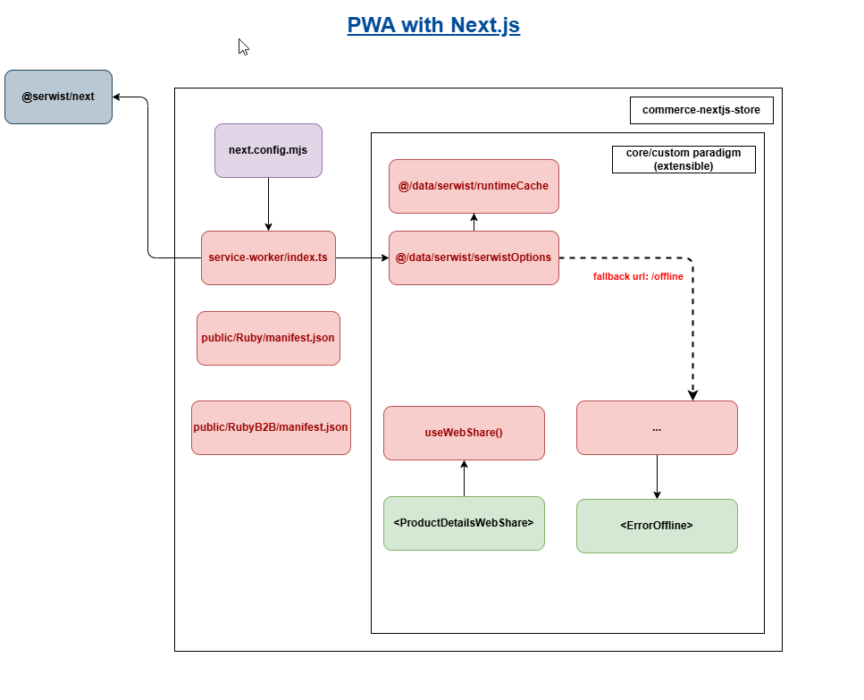
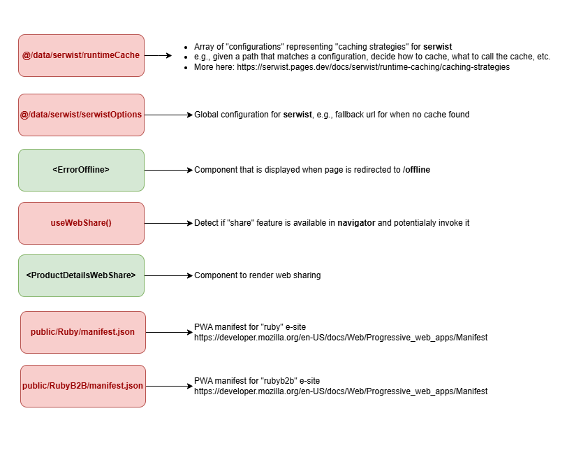

# PWA support

- [PWA support](#pwa-support)
  - [Architecture Diagram](#architecture-diagram)
  - [Next Config](#next-config)
  - [Custom server.ts](#custom-serverts)
  - [Serwist Options](#serwist-options)
    - [Type Declarations](#type-declarations)
    - [Basic Configuration Options](#basic-configuration-options)
    - [Runtime Caching](#runtime-caching)
    - [Fallback Configuration](#fallback-configuration)
    - [Offline Google Analytics playback](#offline-google-analytics-playback)
  - [Caching Configuration](#caching-configuration)
    - [Cache Duration Constants](#cache-duration-constants)
    - [API Path Configuration](#api-path-configuration)
    - [Caching Strategies](#caching-strategies)
      - [Development Mode](#development-mode)
      - [Production Mode](#production-mode)
    - [Cache Strategies Explained](#cache-strategies-explained)
    - [Plugins Used](#plugins-used)
  - [Offline](#offline)
  - [Update notification](#update-notification)

We are using [Serwist](https://serwist.pages.dev/docs) to enable PWA. The PWA implementation is depicted below.

## Architecture Diagram





## Next Config

Next config is updated with PWA related configuration, see [Next Config](./next-config.md)

## Custom server.ts

The cache control response header of service worker request is set to `'no-cache, no-store, must-revalidate'` in file `server.ts`, this ensures that the browser always gets the latest version of the service worker.

## Serwist Options

This configuration file `@/data/serwist/serwistOptions`, consumed by `service-worker/index.ts`, sets up Serwist (a service worker library) for a Next.js application, providing offline capabilities, caching strategies, and fallback behavior.

### Type Declarations

```typescript
declare global {
	interface WorkerGlobalScope extends SerwistGlobalConfig {
		__SW_MANIFEST: (PrecacheEntry | string)[] | undefined;
	}
}
```

This global declaration extends the `WorkerGlobalScope` to include Serwist's configuration types and the precache manifest. The `__SW_MANIFEST` is a special injection point that will be populated with the actual precache manifest during build time.

### Basic Configuration Options

```typescript
{
  precacheEntries: self.__SW_MANIFEST,
  skipWaiting: true,
  clientsClaim: true,
  navigationPreload: true,
}
```

- `precacheEntries`: Uses the automatically generated manifest of files to precache
- `skipWaiting`: Activates new service worker immediately
- `clientsClaim`: Takes control of all pages immediately
- `navigationPreload`: Enables navigation preload optimization

### Runtime Caching

```typescript
{
  runtimeCaching: runtimeCache,
}
```

The `runtimeCache` is imported from a separate file (`@/data/serwist/runtimeCache`) and defines caching strategies for runtime requests. This separation allows for better organization of caching rules.

### Fallback Configuration

```typescript
{
  fallbacks: {
    entries: [
      {
        matcher: ({ request }) =>
          request.destination === 'document' ||
          request.mode === 'navigate',
        url: '/offline',
      },
    ],
  }
}
```

The fallback configuration:

- Catches all navigation requests (document destination or navigate mode)
- Forwards to `/offline` (offline page) when the user is offline and the requested page isn't cached

### Offline Google Analytics playback

```ts
{
  offlineAnalyticsConfig: true,
}
```

This configuration enables two key features:

- First, it caches Google Analytics requests using the Cache Storage API with a `NetworkFirst` strategy.
- Second, it implements a `NetworkOnly` configuration with a `BackgroundSyncPlugin` to capture and store failed Google Analytics requests that occur while offline. These stored requests from `BackgroundSyncQueue` are automatically replayed once the connection is restored.

Reference: [Background Synchronization](https://serwist.pages.dev/docs/serwist/guide/background-syncing)

## Caching Configuration

The caching configuration for the Next.js application defines various caching strategies for different types of assets and requests, optimizing performance and offline capabilities. See `@/data/serwist/runtimeCache` for details on the specific caching strategies and configurations used.

[Serwist Runtime Caching Reference Document](https://serwist.pages.dev/docs/serwist/runtime-caching)

### Cache Duration Constants

The configuration defines several time constants for cache duration:

- 1 hour: 60 \* 60 seconds
- 1 day: 24 \* 60 \* 60 seconds
- 1 week: 7 \* 24 \* 60 \* 60 seconds
- 1 month: 30 \* 24 \* 60 \* 60 seconds
- 1 year: 365 \* 24 \* 60 \* 60 seconds

### API Path Configuration

The service worker identifies API requests using two arrays:

- `API_PATHS_STARTS_WITH`: Paths that begin with specific prefixes (/api/, /wcs/, /search/, /rfq/, /inventory/)
- `API_PATHS_CONTAINS`: Paths that contain specific strings (/model-results/)

These paths are combined into a regular expression (`API_PATHS_REGEX`) for efficient matching.

### Caching Strategies

#### Development Mode

In development (`NODE_ENV !== 'production'`), all requests use `NetworkOnly` strategy to prevent caching.

#### Production Mode

The production environment implements different caching strategies based on resource types:

- Font Resources

  1. Google Fonts Static Content (fonts.gstatic.com)

     - Strategy: CacheFirst
     - Cache Duration: 1 year
     - Max Entries: 4

  2. Google Fonts Stylesheets (fonts.googleapis.com)

     - Strategy: StaleWhileRevalidate
     - Cache Duration: 1 week
     - Max Entries: 4

  3. Static Font Files (.eot, .otf, .ttf, .woff, etc.)
     - Strategy: StaleWhileRevalidate
     - Cache Duration: 1 week
     - Max Entries: 4

- Media Resources

  1. Images (.jpg, .jpeg, .gif, .png, .svg, etc.)

     - Strategy: StaleWhileRevalidate
     - Cache Duration: 30 days
     - Max Entries: 64

  2. Audio Files (.mp3, .wav, .ogg)

     - Strategy: CacheFirst
     - Cache Duration: 24 hours
     - Max Entries: 32
     - Additional: Supports range requests

  3. Video Files (.mp4, .webm)
     - Strategy: CacheFirst
     - Cache Duration: 24 hours
     - Max Entries: 32
     - Additional: Supports range requests

- Next.js Specific Resources

  1. Static JS Assets (/\_next/static/\*.js)

     - Strategy: CacheFirst
     - Cache Duration: 24 hours
     - Max Entries: 64

  2. Next.js Image Optimization (/\_next/image)

     - Strategy: StaleWhileRevalidate
     - Cache Duration: 24 hours
     - Max Entries: 64

  3. Next.js Data Files (/\_next/data/\*.json)
     - Strategy: NetworkFirst
     - Cache Duration: 24 hours
     - Max Entries: 32

- Static Assets

  1. JavaScript Files

     - Strategy: StaleWhileRevalidate
     - Cache Duration: 24 hours
     - Max Entries: 48

  2. Stylesheets (.css, .less)

     - Strategy: StaleWhileRevalidate
     - Cache Duration: 24 hours
     - Max Entries: 32

  3. Data Files (.json, .xml, .csv)
     - Strategy: NetworkFirst
     - Cache Duration: 24 hours
     - Max Entries: 32

- API and Special Routes

  1. API Requests

     - Strategy: NetworkFirst
     - Cache Duration: 24 hours
     - Max Entries: 16
     - Network Timeout: 10 seconds

  2. RSC (React Server Components) Prefetch

     - Strategy: NetworkFirst
     - Cache Duration: 24 hours
     - Max Entries: 32

  3. RSC Regular Requests

     - Strategy: NetworkFirst
     - Cache Duration: 24 hours
     - Max Entries: 32

  4. HTML Pages
     - Strategy: NetworkFirst
     - Cache Duration: 24 hours
     - Max Entries: 32

- Fallback Caching

  1. Same-Origin Uncategorized Requests

     - Strategy: NetworkFirst
     - Cache Duration: 24 hours
     - Max Entries: 32

  2. Cross-Origin Requests
     - Strategy: NetworkFirst
     - Cache Duration: 1 hour
     - Max Entries: 32
     - Network Timeout: 10 seconds

### Cache Strategies Explained

- **CacheFirst**: Serves from cache, falling back to network if not cached
- **NetworkFirst**: Attempts network request first, falling back to cache if network fails
- **StaleWhileRevalidate**: Serves from cache while updating cache in background
- **NetworkOnly**: Always uses network, never caches (development mode)

### Plugins Used

- **ExpirationPlugin**: Manages cache size and entry lifetime
- **RangeRequestsPlugin**: Enables partial content requests for media files

## Offline

This Progressive Web Application (PWA) supports offline functionality. While offline, shoppers can view previously cached pages, but they cannot perform Create, Update, or Delete operations.

The offline page display is set up in the [Fallback Configuration section](#fallback-configuration). When shoppers attempt to access a page that hasn't been cached by the service worker while offline, they will be shown a dedicated offline page.

## Update notification

Since we are configured to serve our pages with `network-first` strategy, any time a new version of service worker is detected, it will be downloaded automatically. To avoid a possible out of synchronization scenario, a message will be displayed to the shopper, prompt the shopper to refresh and apply the updates.

There are two configurations contribute to update scenario

1. Caching configurations can be found in `@/data/serwist/runtimeCache`, see [Cache Strategies](#caching-strategies)
2. `skipWaiting` and `clientsClaim` in [Serwist Options](#serwist-options)
3. the Next.js logic that handles update notification can be found in `@/components/serwist/PWAUpdateNotification` and `@/data/context/PWAUpdate`

References:

- https://web.dev/articles/service-worker-lifecycle
- https://serwist.pages.dev/docs/window
- https://developer.mozilla.org/en-US/docs/Web/API/Service_Worker_API/Using_Service_Workers
