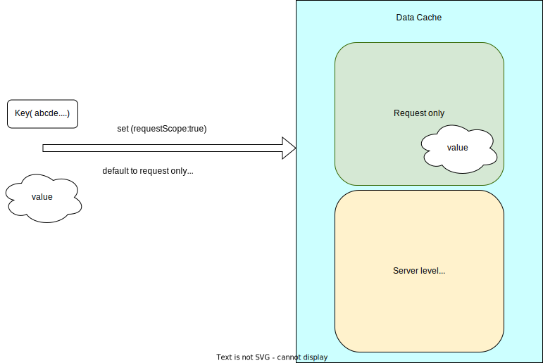
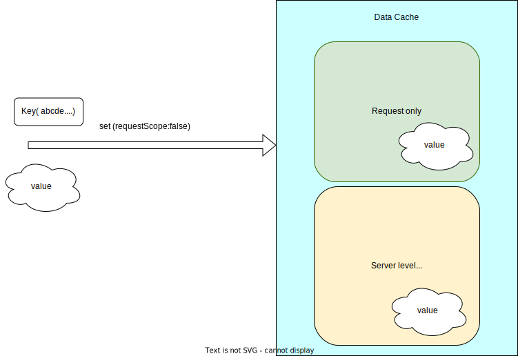
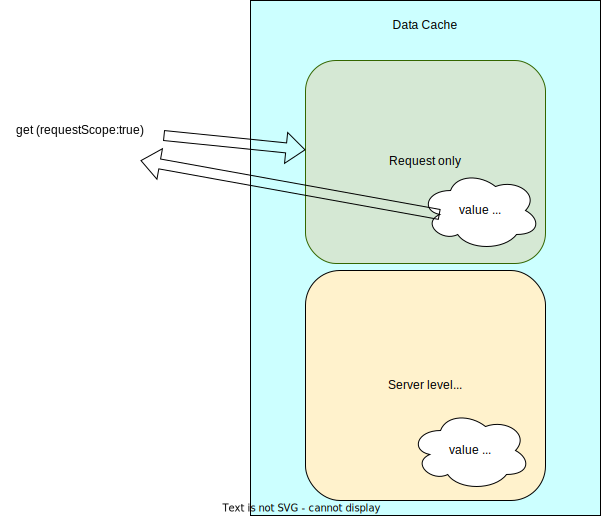
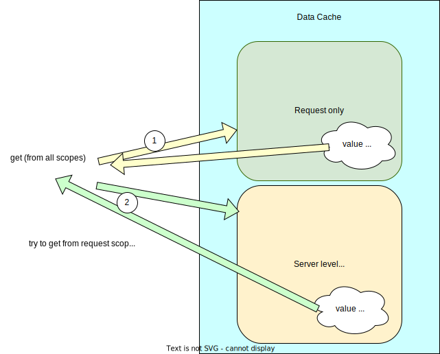

## Server side data cache

Server side cache is defined in following files

1. `integration/data/core/types/Cache.ts`, defines cache interface
2. `integration/data/core/utils/getCache.ts`, the logic part of cache implementation

The cache at server side can be considered in one of two ways:

### Request scope cache

By default and also for backward compatibility, most of caches are saved in request scope. Request scope cache doesn't care about user type, whether it is in preview or not, etc. Since it only can last for a request. Request scope cache entries are returned to client as SWR `fallback`.

### Server memory cache

Memory cache are persisted across different request. (For now, default to 1 min), remove it once we have invalidation mechanism.

To use memory cache, when `set` and `get`, we need to provide a `cacheScope` parameter. CacheScope type is defined in `integration/data/core/types/Cache.ts`. An util function `getServerCacheScope` is available to use if data needs to be saved in server memory cache and it is session sensitive. Otherwise, if the data does not care about session and need to saved in memory cache, we can just use
`const cacheScope = {requestScope: false}; ` and pass it to cache functions.

```ts
const cacheScope = getServerCacheScope(context, user.context);
const params = constructRequestParamsWithPreviewToken({ context });
const value =
	cache.get(key, cacheScope) || fetcher(false)(props.storeId, props.emsName, props.query, params);
cache.set(key, value, cacheScope);
```

Sometimes, the data is not necessarily returned to client in `SWR` `fallback` and only need cache at the server. In this case, the `setPersistentOnly` function can be used.

### The cache scope mechanism

There are two caches in OOTB Next.Js server

1. request only cache, the cache object is new for each request and only persisted within a request.
2. server level memory cache, the cache exists as long as the

#### set to request scope

The key value pair will be stored in request cache.



#### Set to all scopes with flag requestScope=false

The key value pair will be stored server level as well as request level



#### Get cache entry from request

The cached entry is retrieved from request cache.



#### Get cache entry from all scopes

Cached entry is first attempt to retrieve from request cache, if cannot found, then try to get from server level cache.



### Page level fallback data cache

1. do not cache

   - `preview`
   - login protected routes
   - `cart / user` part of cache need to be replaced(or not to put into server level cache and not part of fallback? min-cart and my account dropdown). **TBD**

2. cache by:

   - user register type
   - url keyword path (pathIdentifier)
   - storeId
   - languageId

3. cache spec

   see type definition in integration/data/core/types/Cache.ts

### Server side remote cache using Redis

TBD

### Cache invalidation

TBD
