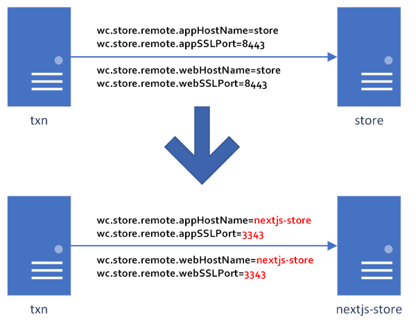
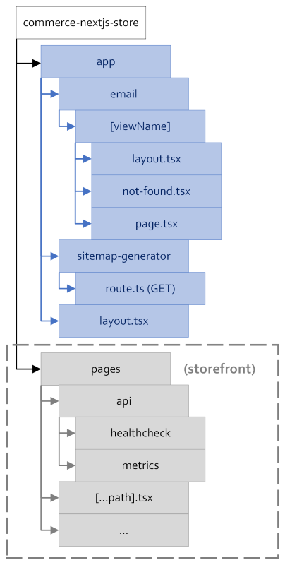
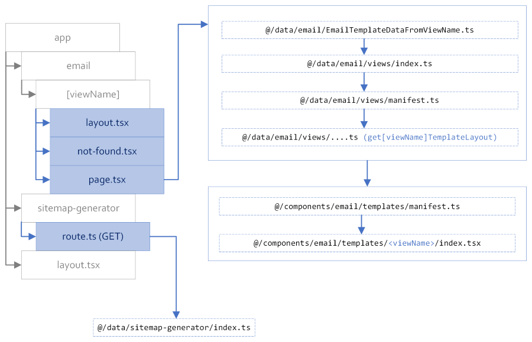

# Email Templates and Sitemap Generator

- [EPIC Level Breakdown](#epic-level-breakdown)
- [Related Stories/Tasks](#related-stories-tasks)
- [Overview](#overview)
- [Solution Design Overview](#solution-design-overview)
- [Background](#background)
- [Feasibility Assessment](#feasibility-assessment)
- [Assumptions](#assumptions)
- [Dependencies](#dependencies)
- [Implementation Details](#implementation-details)
- [Serviceability and Issue Reporting](#serviceability-and-issue-reporting)
- [Caching Requirement](#caching-requirement)
- [Security Considerations](#security-considerations)
- [API Endpoints](#api-endpoints)
- [Migration](#migration)
- [Deployment Considerations](#deployment-considerations)
- [Container Design Best Practices Checklist](#container-design-best-practices-checklist)
- [Documentation](#documentation)
- [Performance & Scalability](#performance-scalability)
- [Milestone](#milestone)
- [Functional Milestone #1](#functional-milestone-1)
- [Performance Milestone](#performance-milestone)

## EPIC Level breakdown

Work tracked under [HC-34260](https://jira02.hclpnp.com/browse/HC-34260).

## Related Stories/Tasks

N/A

## Overview

HCL Commerce as a platform provides a means of sending notifications via various transports. The content sent through those transports (HTML) has previously been rendered using a "remote" store, which has been the JSP-based storefront (commerce-remote-store or CRS) usually deployed on the `store` container.

When the client-side rendered React.JS storefronts (Emerald, Sapphire) were introduced, this still remained the case because a key requirement of achieving a render is server-side rendering, which these storefronts (being client-side rendered) were not able to provide. This had the side-effect of using a "new" platform for serving storefronts but still using the "old" platform to achieve this "side task" for rendering emails for notifications etc. Of course this also implied that both the `store` and `store-web` containers needed to be deployed together. Customers would also have to continue to manage both containers in order to have a "fully functional" site running, i.e., if email template rendering was a key requirement of such a site.

Since Next.JS storefronts are server-side rendered, there should no longer be a need to have to stand-up the CRS container, since both the storefront and email templates should be render-able by the `nextjs-store` container. As of 9.1.15.0, only the storefront is implemented on the container. This EPIC aims to resolve the implementation of email templates.

In addition to email templates, CRS was also used to provide sitemap generation function for customers using the `SitemapGenerate` command. With the implementation of email templates on the Next.JS container, sitemap generation will be implemented as well.

## Solution Design Overview

The general proposal around the idea of switching the content renderer from CRS to the Next.JS container was to make minimal changes on TS and simply provide a new implementation of generic content renderer on the Next.JS container to perform the work.

The minimal set of changes on TS involve updating any variables that refer to the "remote" store to now point to the Next.JS container, i.e.,

Additionally, since email templates (and sitemap generation) rely on server-side rendering (only) and do not require any client-side interaction, the **app** router of Next.JS is viable candidate for implementation of these features (not just because of simplicity but also because it is a newer implementation in the Next.JS framework).

Within the implementation, the goal will be to have each "template" (or the sitemap generator) be its own entity so that customization/extension can be done easily (using the `core/custom` customization paradigm already present in the codebase).

## Background

See [Overview](#overview) section

## Feasibility Assessment

N/A

## Assumptions

See [Overview](#overview) section

## Dependencies

The TS container is indirectly impacted because it is what stores the host and port configuration for the "remote" store.

The OOB configuration that sets the variables to the appropriate values will not be changed. Instead the process to make this change will be documented.

The rationale for not making this change is that in addition to email template rendering and sitemap generation, at least two of the values to be updated are also used for store-preview configuration for the commerce remote store (CRS). Making the change will effectively render CRS store-preview unusable and while this may be okay for new deployments, it will (probably) cause churn for migrated environments where adopters are perhaps not ready to use just the Next.JS store.

The statement of support for a switchover will necessarily assert that one and only one type of remote store may be active at a time, i.e., either CRS or Next.JS. A dual approach is not recommended and probably not a good idea anyway.

## Implementation Details

### _Transaction Server_

Key considerations/changes made were:

- The original plan with respect to updating configuration was:
  - Update configuration XML file (that is usually used in toolkit-type environment) to point to the Next.JS server `src/projects/WC/xml/config/com.ibm.commerce.foundation/wc-component.xml`.
  - Set the initial invocation (specified in `Dockerfile.template`) that sets JVM system properties for the "remote" store to point to `nextjs-store` and `3343`, i.e.,
    - `wc.store.remote.appHostName`
    - `wc.store.remote.appSSLPort`
    - `wc.store.remote.webHostName` (external host)
    - `wc.store.remote.webSSLPort` (external port)
  - Update other targets used by shell scripts to use `nextjs-store` and `3343` as defaults.
- Instead, the documentation will now outline the setting of these environment variables (that can be set in shell script or YAML):
  - `STOREWEB_HOST` (external host)
  - `STOREWEB_PORT` (external port)
  - `STORE_HOST` (internal remote store host, e.g., `nextjs-store`)
  - `STORE_PORT` (internal remote store port, e.g., `3343`)
- There is an additional property that is used during remote store invocation, i.e., `wc.store.remote.webContextPath`, which is usually set to `/wcs/shop`. This property was not updated since it may be used in other invocations. Ideally a change to the remote store would imply this property would need to be updated as well but a change at the Next.JS was instead made to accommodate the presence of this unnecessary leading path. **(\*\*)**
- Update 2024-03-18: for the upcoming release (🥭), the Next.JS store will indeed be the default remote store; the documentation will be updated to indicate that a switch over to the Next.JS store is only necessary for the V9.1 stream.

### _Email Templates_

Key file/folder locations of interest:

- `app/email/[viewName]/`
- `integration/data/core/email/`
- `middleware.ts`
- `presentation/components/core/email/`

Next.JS documentation for the **app** router paradigm is [here](https://nextjs.org/docs/app/building-your-application/routing). Since email templates will leverage the **app** router, the `app/email/[viewName]` specifies the landing page where email templates will be rendered from. This makes the path discrete enough from any storefront pages, such that chances of collisions are greatly reduced, i.e., route similarity. The `[viewName]` portion of the route implies the variable portion of the path, where any template route can be rendered from.

Once invoked, logic similar to that which is used to resolve storefront content is used to resolve a possible email template using a set of indexed "known" email templates in `integration/data/core/email/views/manifest.ts`. The view names are exactly identical to the view names that TS recognizes with the "View" suffix removed (this is done by the invocation of the function implemented in `integration/data/core/email/utils/getTemplateNameFromViewName.ts`). Specifying the suffix is not harmful as the resolver will only attempt resolution after removal, e.g., `OrderReceivedView` resolves to `OrderReceived`.

If not resolved, a 404 (server-side) is thrown/rendered. Otherwise, the `layoutName` property of the returned object is used to locate the presentation layer component that renders the template. The layouts are indexed by name in the `presentation/components/core/email/templates/manifest.ts` file.

The known set of email template views currently implemented are:

- ActivateTaskNotification
- ApproversNotify
- InterestItemListMessage
- MerchantOrderNotify
- OrderAuthorized
- OrderCancel
- OrderChanged
- OrderReceived
- OrderRejected
- PasswordNotify
- PasswordResetConfirmationNotify
- ReadyToApproveTaskGroupNotification
- RejectTaskNotification
- ReleaseShipNotify
- ResellerRegistrationApprovedNotify
- ResellerRegistrationRejectedNotify
- UserAccountEmailActivateNotify

These correspond exactly to the views referenced from TS, with the "View" suffix removed during resolution (as indicated earlier).

The `middleware.ts` file provides some "server-level" function to resolve the discrepancy identified in bullet **(\*\*)** in the [Transaction Server](#transaction-server) section above. For email templates, the middleware effectively compares the terminating component of the landing URL to the known-set of email templates (with the "View" suffix added). If found, it discards any leading components of the landing URL and rewrites the request to a known email template landing page, e.g., `/wcs/shop/OrderReceivedView?...` is rewritten to `/email/OrderReceived?...`. This is assumed to be a safe rewrite since the email template view names are "known" and "unique". If there is an overwrite at a deployment, then the adopter will have to address the rewrite by updating the file (`middleware.ts`).

Note that as before, any marketing content rendered into the e-mail template HTML, will have any relative image paths updated to refer to the **local** host-name as the origin. In addition, if the store associated with the `storeId` supplied when the template view is invoked, has an `hcl.imagePath` `STORECONF` table attribute specified, the value associated with that attribute is injected between the origin and the relative path of any images. If there is a base-path associated with the storefront (Next.JS server-specific configuration), then that value is injected as well. The output template is: `${origin}{base-path}{hcl.imagePath}{image-relative-path}`

As an example, consider:

- marketing content references an image with relative path `/relative/image/path.png`
- the `STORECONF` table attribute value for the `hcl.imagePath` attribute for the specified store is `/prefix/`
- the Next.JS storefront has a base path of `/base/`
- the origin is `https://nextjs-store:3343/`

The resulting absolute URL for the image that will be returned in the rendered HTML will be:

`https://nextjs-store:3343/base/prefix/relative/image/path.png`

The path generator function will account for duplicate or missing path separators and any missing or empty path components are filtered out.

As before, content returned to TS with the remote store host and port value will be replaced with the external host and port value (this replacement is done by TS).

### _Sitemap Generator_

Key file/folder locations of interest:

- `app/sitemap-generator`
- `integration/data/core/sitemap-generator/`
- `middleware.ts`

A landing at `/sitemap-generator` invokes the `GET` function located in `app/sitemap-generator/route.ts`. This implementation is effectively done as an API endpoint. The **app** and **pages** router implementations of Next.JS emphasize rendering of "HTML" and since sitemaps render basic "XML" (especially with the `Content-Type` response header), such an implementation is only possible using an "API" endpoint. In other words, this is merely some syntactic sugar to achieve the desired result. The endpoint effectively just calls the `SitemapGenerator` function located in `integration/data/core/sitemap-generator/index.ts`.

The function generates the sitemap with "home page" and any "static" URLs retrieved from TS. "Search" landing URLs are not included inside the generated site map because ES doesn't appear to provide such a function and no OpenAPI spec has been provided for function that does exist in TS. This can potentially be an exercise left up to an adopter. As before, since the code exists under the `core/custom` paradigm, all function here should be extensible by adopters to fine-tune any URL or overall XML generation.

Similar to email templates, the `middleware.ts` file provides some "server-level" function to resolve the discrepancy identified in bullet **(\*\*)** in the [Transaction Server](#transaction-server) section above. For sitemap generation, this involves checking if the terminating component of the landing URL is equivalent to `SEOSiteMapView` (the known sitemap generator route on CRS). If found, it discards any leading components of the landing URL and rewrites the request to `sitemap-generator`, e.g., `/wcs/shop/SEOSiteMapView?...` is rewritten to `/sitemap-generator?...`. This is also assumed to be a safe rewrite since the view name is "known" and "unique". If there is an overwrite at a deployment, then the adopter will have to address the rewrite by updating the file (`middleware.ts`).

## Serviceability and Issue Reporting

Diagnostic logging has been improved overall for the storefront and has been added to the email template and sitemap-generation thread flows to capture diagnostic data in case issues are encountered.

This logging leverages the pino-logger (as is already the case for the overall storefront) using the `debug` value for the `LOG_LEVEL` environment variable specified during deployment.

See instructions inside `logging/core/logger.ts` for more details. Current diagnostic output is to `stdout` which is capture-able by running pods/containers.

### Customer Awareness

N/A: see above

### Problem Determination (PD)

N/A: see above

## Caching Requirement

No change to any TS caching.

The Next.JS container's existing caching strategy will be used in any server-side API calls made. Currently only e-spot and product information is fetched from any email templates. These already have a caching scheme in the Next.JS server. The current TTL is 1-min which can be overridden (or turned off).

Previous work to diagnose and determine the performance of the storefront has relied on Next.JS server's caching strategy to improve scalability. The same should be applicable for email templates since the same codebase is being leveraged for any server-side fetches.

## Security Considerations

No specific impact, except perhaps for logging, since new logging (via pino-logger) has been introduced. The `logging/core/redactionKeys.ts` file has been updated to redact values for keys that match a certain expected pattern.

## API Endpoints

No new TS API endpoints were introduced or used.

The implementation of the **Sitemap Generator** was done as an API endpoint on Next.JS server (see [Sitemap Generator](#sitemap-generator) section).

In the **app** router, API endpoints are implemented with a `route.(ts|js)` file that describes the method of the API. For the **Sitemap Generator**, this is a straightforward `GET` implementation located at `app/sitemap-generator/route.ts`. More information [here](https://nextjs.org/docs/app/building-your-application/routing/route-handlers).

## Migration

See [Dependencies](#dependencies) section

## Deployment Considerations

See [Dependencies](#dependencies) section

## Container Design Best Practices Checklist

N/A

## Documentation

- The GIT Bundle will document implementation details of the **Email Templates** and the **Sitemap Generator**. This will include:
  - Location of files and lookup method
  - Deterministic list of templates currently implemented
  - Showcasing of **Email Templates** using `storybook` and `mockserver`
- The knowledge center will document the list of templates implemented as well as screenshots of some samples
  - Some instructions on how to start the "showcase"
  - Switching over TS to use the Next.JS server as the **Email Templates** and **Sitemap Generator** rendering remote store

## Performance & Scalability

See [Caching Requirement](#caching-requirement) section

## Milestone

N/A: no partial work

## Functional Milestone #1

N/A: no partial work

## Performance Milestone

N/A: see [Caching Requirement](#caching-requirement) section
