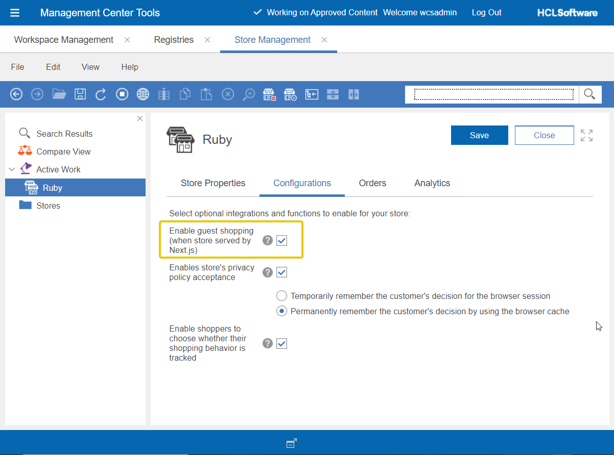

# Guest shopping

- [EPIC Level Breakdown](#epic-level-breakdown)
- [Related Stories/Tasks](#related-stories-tasks)
- [Overview](#overview)
- [Solution Design Overview](#solution-design-overview)
- [Background](#background)
- [Feasibility Assessment](#feasibility-assessment)
- [Assumptions](#assumptions)
- [Dependencies](#dependencies)
- [Implementation Details](#implementation-details)
- [Serviceability and Issue Reporting](#serviceability-and-issue-reporting)
- [Caching Requirement](#caching-requirement)
- [Security Considerations](#security-considerations)
- [API Endpoints](#api-endpoints)
- [Migration](#migration)
- [Deployment Considerations](#deployment-considerations)
- [Container Design Best Practices Checklist](#container-design-best-practices-checklist)
- [Documentation](#documentation)
- [Performance & Scalability](#performance-scalability)
- [Milestone](#milestone)
- [Functional Milestone #1](#functional-milestone-1)
- [Performance Milestone](#performance-milestone)

## EPIC Level breakdown

Work tracked under [HC-37226](https://jira02.hclpnp.com/browse/HC-37226).

## Related Stories/Tasks

N/A

## Overview

In previous releases of the NextJs store, guest shopping behavior was hardcoded in the code. We were enabling guest shopping based on store type, guest shopping for B2C store is enabled OOTB without an option to turn it off. We need to provide a way to make it configurable, not only at the already-existing access control level but also at the UI level in NextJs.

## Solution Design Overview

#### Configurations

To configure the enabling or disabling of guest shopping, similar to what we have for the JSP store (Aurora), it requires two steps:

1. Subscribe to the access control policy group (existing support in the Organization Administration Console).
2. Enable `GuestShopping` `FlexFlow` in CMC store management tool.

We now use the configurations from the `FlexFlow` in storefront to determine:

1. Whether to show or hide particular shopping-related UI components for guest shoppers.
2. Whether to enable or block access to certain shopping-related routes for guest shoppers.

#### Components that depends on the config

1. Add to cart button, if

- guest shopping configuration is enabled: let shopper add to cart.
- guest shopping configuration is disabled: show `sign in to shop` button instead.

2. Sign in page behavior:
   With guest shopping enabled, if landing on Sign in page:

- from clicking `Checkout` button, show `Sign in and continue` and `continue as guest` buttons.
- from any other actions, the page behaves as usual, only show `Sign in` button.

3. Protected route

- `checkout` route: checkout route is protected based on current shopper's cart regardless of whether the shopper is a guest or registered shopper. The route is not accessible if cart is empty.

## Background

TBD

## Feasibility Assessment

N/A

## Assumptions

See [Solution Design Overview](#solution-design-overview) section

## Dependencies

N/A: only existing APIs were consumed and new UI functions (only) implemented.

## Implementation Details

**Key Implementation Updates:**

- Introduced new Next.js store specific FlexFlow `GuestShopping`

## Serviceability and Issue Reporting

N/A

### Customer Awareness

N/A: see above

### Problem Determination (PD)

N/A: see above

## Caching Requirement

N/A: no impact since only existing APIs were used.

## Security Considerations

N/A: no impact since only existing APIs were used.

## API Endpoints

N/A: no new TS API endpoints were introduced or used

## Migration

There are updates to some `core` components in the following files:

- `integration/data/core/Content/ProductDetails.ts`
- `integration/data/core/Content/SkuListTable.ts`
- `presentation/components/core/blocks/ProductDetails/AddToCart.tsx`
- `presentation/components/core/content/Login/parts/RegisterOrCheckout.tsx`

There are no changes to function signatures and will not break any customizations.

For customers who haven't customized these files, no migration is required.

For customers who have customized some of these files and want to take advantage of this new feature, they can easily compare the differences in the core components and apply the changes to their custom components.

## Deployment Considerations

N/A

## Container Design Best Practices Checklist

N/A

## Documentation

The Knowledge center will document steps to enable and disable guest shopping for NextJs store.

## Performance & Scalability

N/A, no new API added into execution.

## Milestone

N/A: no partial work

## Functional Milestone #1

N/A: no partial work

## Performance Milestone

See [Performance & Scalability](#performance--scalability) section.

## Enable Guest Shopping

1. Organization Administration Console:

   - Open the Organization Administration Console.
   - Navigate to `Access Management` > `Find Organizations`.
   - Locate the organization that owns the store for which you are enabling guest shopping.
   - For an extended site, select the organization that owns the extended site store.
   - Check the box next to the organization.
   - Click on Policy Subscription.
   - In the Available Policy Groups section, select the policy group named store_name GuestShoppingEnabledPolicyGroup, where store_name is the name of your published store.

     For example, if the store name is Sapphire, select SapphireSAS GuestShoppingEnabledPolicyGroup.

   - Click Add, and then click OK.

2. Store Management Tool in the Management Center for HCL&reg; Commerce:

   - Log in Management Center for HCL&reg; Commerce
   - From the menu, select the `Manage Stores` > `Store Management`
   - Find the store served by Next.js that needs to enable guest shopping
   - Go to `Configurations` tab, check the `Enable guest shopping (when store served by Next.js)` checkbox.

   

3. Restart the Commerce server or refresh registries in the Management Center for HCL&reg; Commerce.
