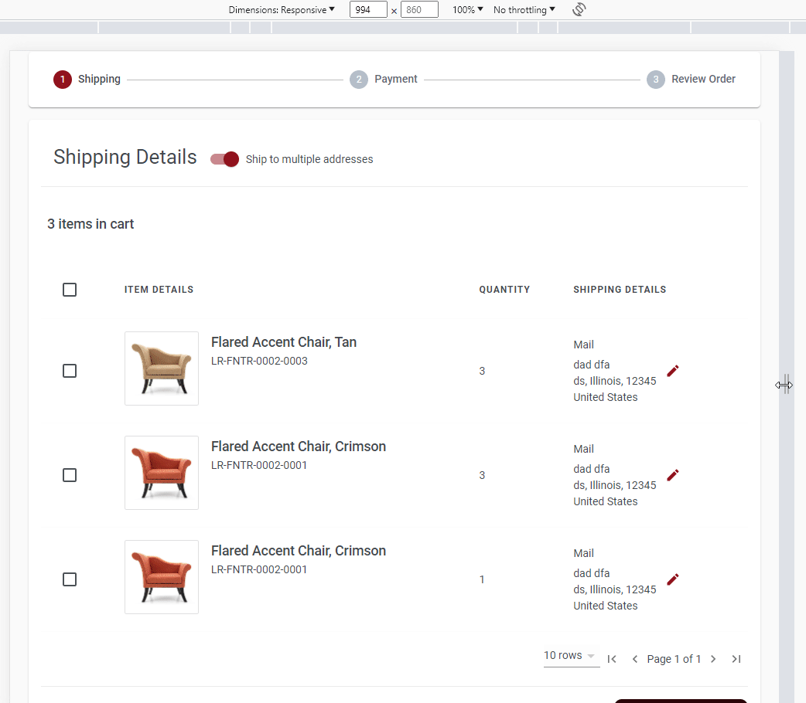

# Table building blocks

This folder contains basic building block for table.

## General purpose table

The general structure of the table is shown below:

```tsx
<Table>
	<TableHead>
		<TableRow>
			<TableCell>{your table column head}</TableCell>
		</TableRow>
	</TableHead>
	<TableBody>
		<TableRow>
			<TableCell>{your table cell content}</TableCell>
		</TableRow>
	</TableBody>
</Table>
```

## Responsive table

The table components also support responsive behavior for mobile views. To enable this feature, the table needs to be structured as shown below:

```tsx
<Table>
	<TableHead responsive>
		<TableRow>
			<TableCell>{your table column head}</TableCell>
		</TableRow>
	</TableHead>
	<TableBody>
		<TableRow responsive>
			<TableCell responsive>
				<TableCellResponsiveContent label={'your column head label'}>
					{your table cell content}
				</TableCellResponsiveContent>
			</TableCell>
		</TableRow>
	</TableBody>
</Table>
```

The key of responsive table is the `responsive` prop.

## Responsive table with expandable row

```tsx
<Table>
	<TableHead responsive>
		<TableRow>
			<TableCell>{your table column head}</TableCell>
		</TableRow>
	</TableHead>
	<TableBody>
		<TableRow responsive expanded={row.getIsExpanded()}>
			<TableCell responsive>
				<TableCellResponsiveContent label={'your column head label'}>
					{your table cell content}
				</TableCellResponsiveContent>
			</TableCell>
		</TableRow>
		{row.getIsExpanded()? <TableRow responsive expandedContent>
			<TableCell responsive>
					{your row expanded content}
			</TableCell>
		</TableRow>: null}
	</TableBody>
</Table>
```

sample demo


